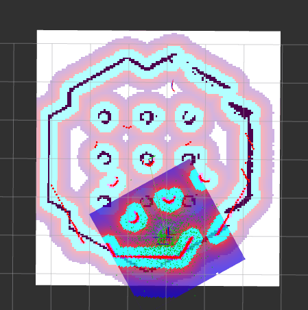
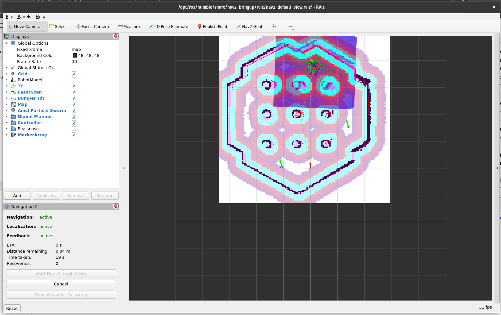

# TP AS_ros2_nav_sivmulation_project

Author: Antoine PERRONO, 4IRC, 2025

## Pour lancer la simulation

```bash
ros2 launch turtlebot3_gazebo turtlebot3_world.launch.py
```

## Topic pour déplacer le robot

On peut récupérer la liste des topics avec :

```bash
> ros2 topic list
/camera/camera_info
/camera/image_raw
/camera/image_raw/compressed
/camera/image_raw/compressedDepth
/camera/image_raw/theora
/clock
/cmd_vel
/imu
/joint_states
/odom
/parameter_events
/performance_metrics
/robot_description
/rosout
/scan
/tf
/tf_static
```

En regardant, on voit que le topic `/cmd_vel` permet d'envoyer des messages de type **Twist**, habituellement utilisé pour gérer des déplacements :

```bash
> ros2 topic info /cmd_vel
Type: geometry_msgs/msg/Twist
Publisher count: 0
Subscription count: 1
```

En fouillant les noeuds (`ros2 pkg list`), ` semble correspondre à un noeud de controle. On peut le lancer avec :
```bash
> ros2 run teleop_twist_keyboard teleop_twist_keyboard

This node takes keypresses from the keyboard and publishes them
as Twist/TwistStamped messages. It works best with a US keyboard layout.
---------------------------
Moving around:
   u    i    o
   j    k    l
   m    ,    .

For Holonomic mode (strafing), hold down the shift key:
---------------------------
   U    I    O
   J    K    L
   M    <    >

t : up (+z)
b : down (-z)

anything else : stop

q/z : increase/decrease max speeds by 10%
w/x : increase/decrease only linear speed by 10%
e/c : increase/decrease only angular speed by 10%

CTRL-C to quit
``` 

## Cartographer

On peut voir quels arguments peuvent être pris en utilisant `--show-args` :
```bash
> ros2 launch turtlebot3_cartographer cartographer.launch.py --show-args
Arguments (pass arguments as '<name>:=<value>'):

    'cartographer_config_dir':
        Full path to config file to load
        (default: LaunchConfig('cartographer_config_dir'))

    'configuration_basename':
        Name of lua file for cartographer
        (default: LaunchConfig('configuration_basename'))

    'use_sim_time':
        Use simulation (Gazebo) clock if true
        (default: 'false')

    'resolution':
        Resolution of a grid cell in the published occupancy grid
        (default: LaunchConfig('resolution'))

    'publish_period_sec':
        OccupancyGrid publishing period
        (default: LaunchConfig('publish_period_sec'))
```

Nous, on cherche l'argument : `use_sim_time`, on va dont utiliser :
```bash
> ros2 launch turtlebot3_cartographer cartographer.launch.py use_sim_time:=true
```

Pour voir quels nodes sont lancés par ce launch filen, on peut utiliser `ros2 node list` :
```bash
> ros2 node list
/cartographer_node
/cartographer_occupancy_grid_node
/rviz2
/transform_listener_impl_568576ae8e20
/transform_listener_impl_62a6e1588760
```

## RViz VS Gazebo

- RViz est un outil de visiualisation,
- Gazzbo est un simulateur.

## Map

On peut voir la map enregistrée dans le fichier map_1744614110.pgm. Quand à lui, le fichier yaml joint contient différentes informations comme :

- image: le nom de la carte
- resolution: taille pixel vs mètre
- origin: Position de l'origine
- occupied_thresh / free_thresh : seuils pour considérer un pixel comme occupé ou libre

## Lancer la navigation autonome

Pour régler le `Global Status: Error - Fixed Frame`, il faut utiliser l'option:

- 2D Pose Estimate

Ca nous permet d'obtenir ça et de pouvoir faire de la navigation autonome:


## Waypoint 



La différence principale entre "Start Nav Through Poses" et "Start Waypoint Following" réside dans la manière dont le robot suit les instructions.
"Nav Through Poses" fait suivre au robot une trajectoire stricte avec position et orientation, tandis que "Waypoint Following" le guide simplement à travers une série de points, avec plus de souplesse dans le mouvement et une meilleure tolérance aux obstacles.

## Personnalisons maintenant notre environnement !

